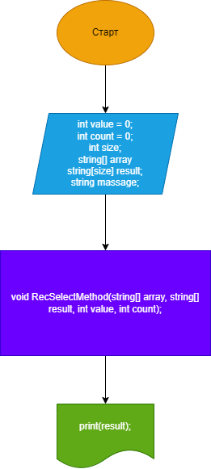

# Функция программы.
+ Программа принимает на вход из консоли строковый тип данных.
+ Обрабатывае строковый тип данных.
+ Выводит массив данных состоящий из строк от 1 до 3 символов.
# Составвляющие программы.
Программа состоит из трех методов.
+ Метод, принимающий на вход данные из консоли, и возвращающий значение в виде строкового массива.
+ Метод, обрабатывающий данные из строкового массива данных, и выдающий конечный результат в виде строкового массива строк, включающих от 1 до 3 символов.
+ Метод вывода конечного результата на экран.
# Схема работы программы.
